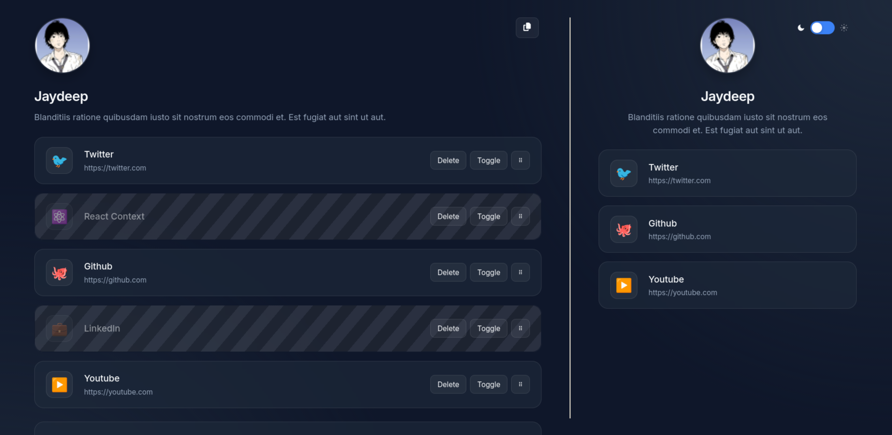

# DevLinks

A Linktree-style link-in-bio manager built with React.
Manage your links, customise your profile, and share a clean preview — all in one place.

🔗 **Live demo:** https://devlinks-iota-one.vercel.app

## Features

- **Add, edit & delete links** — inline editing with double-click
- **Drag to reorder** — smooth drag-and-drop with @dnd-kit
- **Toggle visibility** — hide links without deleting them
- **Profile customisation** — edit name, bio and avatar inline
- **Live preview pane** — see exactly what visitors will see
- **Dark / light theme** — persists across sessions
- **Persistent storage** — all data saved to localStorage
- **Skeleton loading** — polished loading state on first render

## Tech Stack

- React 18 — hooks, context, custom hooks
- useReducer — predictable state management
- @dnd-kit — accessible drag and drop
- CSS custom properties — theme system
- Vite — build tooling
- Vercel — deployment

## What I learned

This was my first React project, built over 2 weeks while
transitioning from WordPress/Shopify theme development.
Key concepts practised: component architecture, lifting state,
context API, useReducer, custom hooks, and drag-and-drop UX.

## Run locally

git clone https://github.com/yourusername/devlinks
cd devlinks
npm install
npm run dev
